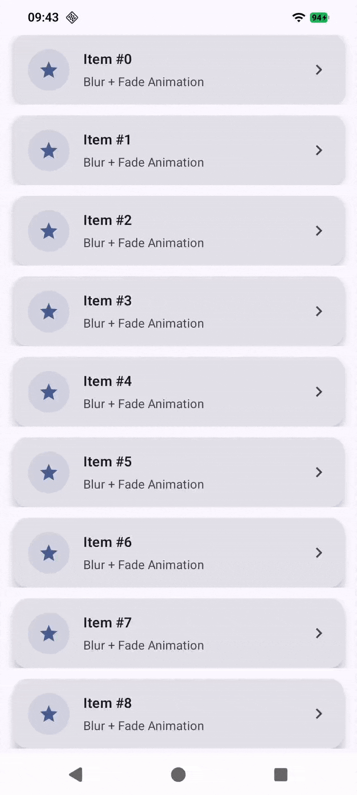
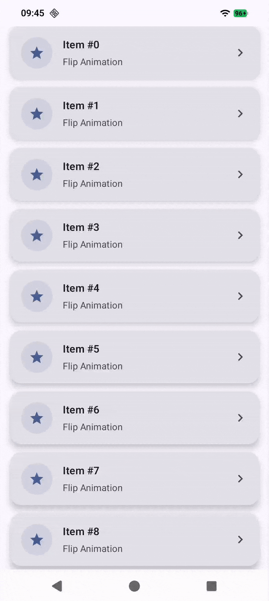
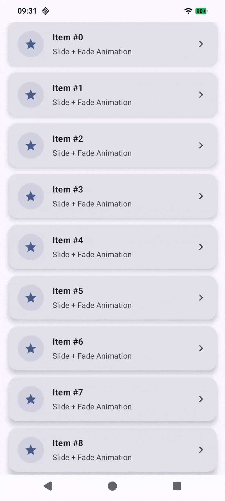

# 🎨 Jetpack Compose Animations

A curated collection of **beautiful, smooth, and production-ready Jetpack Compose animations** ✨  
This repository is built to help Android developers **learn, reuse, and get inspired** by modern Compose animation patterns.

If you love animations that make apps feel *alive*, you’re in the right place 🚀

---

## ⭐ Support the Project

If this repository helped you learn something new or inspired your UI work:

👉 **Please consider giving it a ⭐ star**  
It really helps the project grow and reach more Android developers 💙

---

## 🧩 What’s Inside?

- ✅ Jetpack Compose animation examples
- ✅ Clean, reusable animation components
- ✅ Real-world UI animation use cases
- ✅ Smooth transitions & micro-interactions
- ✅ Beginner → Advanced friendly

All animations are **GIF-recorded directly from Compose** so you can preview them instantly.

---

## 🎥 Animation Showcase

> Each animation includes a GIF preview and a clear name for easy reference.

### 🔹 Bounce Scale Animation
A subtle bounce effect perfect for list items, buttons, and cards.


<p align="start">
  
</p>

---

### 🔹 Blur + Fade Transition
Smooth enter/exit animation for screens and components.

<p align="start">
  
</p>

---

### 🔹 Flip Transition
Smooth enter/exit animation for screens and components.


<p align="start">
  
</p>


---
### 🔹 Scale + Fade Transition
Smooth enter/exit animation for screens and components.

<p align="start">
  
</p>

---
### 🔹 Fade + Slide Transition
Smooth enter/exit animation for screens and components.

<p align="start">
  
</p>

---

> 📌 More animations coming soon — this repo is actively growing!

---

## 🛠 Tech Stack

- **Kotlin**
- **Jetpack Compose**
- Compose Animation APIs
  - `animateAsState`
  - `updateTransition`
  - `AnimatedVisibility`
  - `InfiniteTransition`

---

## 🚀 How to Use

1. Clone the repository
   ```bash
   git clone https://github.com/MohdAsim71/ComposeAnimationPlayground.git
